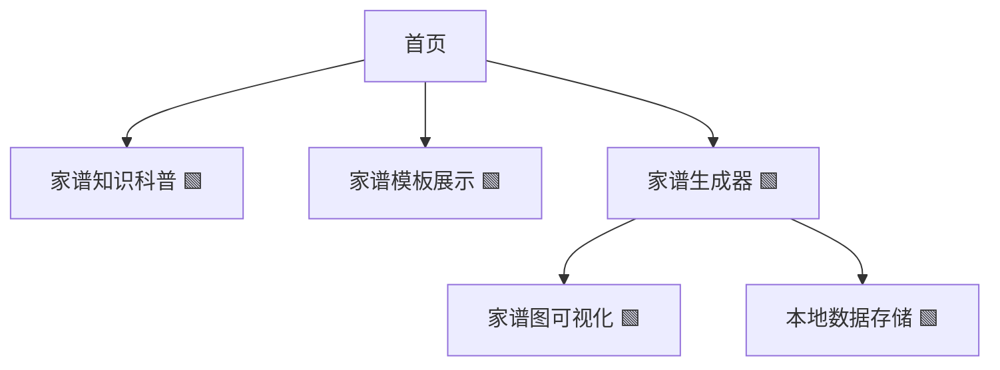
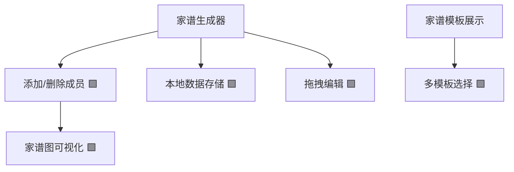
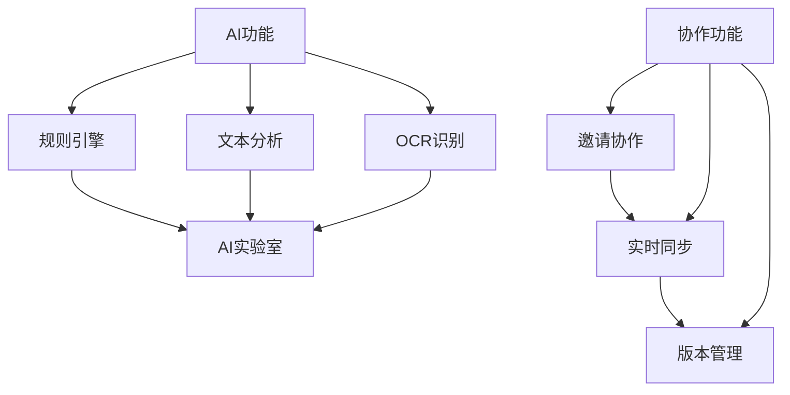

# Family Tree Website Development Plan (Based on Next.js 14, Individual Developer Iteration Plan)

> Note: This is the Chinese version of the development plan. The website interface has been converted to English.

## 一、项目定位与目标

- **定位**：为有家谱创建需求的用户提供简单易用、可视化、可导出的家谱制作工具，兼顾内容科普与实用模板，突出 SEO 优化。
- **目标用户**：家谱初学者、家族历史爱好者、基因研究兴趣者。
- **核心价值**：免费、易用、可视化、内容丰富、移动端友好。

---

## 二、技术选型

- **包管理工具**：pnpm（快速、节省磁盘空间的包管理器） 🟩【已完成】
- **前端框架**：Next.js 14（支持 SSR/SSG，利于 SEO） 🟩【已完成】
- **UI 框架**：Shadcn UI（基于Tailwind的组件库，高度可定制） 🟩【已完成】
- **状态管理**：React Context API（用于全局状态管理） 🟩【已完成】
- **数据存储**：Neon 数据库（云数据库）作为主要存储，本地存储（LocalStorage）作为备份 🟩【已完成】
- **认证系统**：Firebase Authentication（支持Google账号登录） 🟩【已完成】
- **可视化工具**：Mermaid.js（家谱图可视化）🟩【已完成】
- **导出工具**：html2canvas（导出图片）🟩【已完成】、jsPDF（导出 PDF）🟩【已完成】
- **UI组件**：Lucide React（图标库）🟩【已完成】、Radix UI（无障碍组件）🟩【已完成】
- **内容管理**：MDX/Markdown 支持，便于内容型页面维护 🟥【待开发】
- **部署**：Vercel 部署，优化自动化构建及发布流程 🟩【已完成】
- **域名配置**：已配置域名 www.family-tree.cc，支持 HTTPS 访问 🟩【已完成】

---

## 三、功能迭代路线（从易到难）

### 1. MVP 阶段（基础功能）

- 首页：项目介绍、SEO 关键词布局 🟩【已完成】
- 家谱知识科普页：静态内容，分步指南、常见问题（FAQ） 🟩【已完成】
- 家谱模板展示页：静态模板图片/表格，支持下载 🟩【已完成】
- 简单家谱生成器（表单式）：用户输入成员信息，生成树状结构（静态渲染） 🟩【已完成】
- 移动端适配 🟩【已完成】

#### Mermaid 结构图

---

### 2. 进阶阶段（增强交互）

- 家谱生成器升级：可视化拖拽添加成员、编辑关系 🟩【已完成】
- 家谱图可视化：集成 Mermaid.js 渲染 🟩【已完成】
- 家谱数据本地保存/导入导出（JSON） 🟩【已完成】
- 模板多样化：支持多种家谱结构（祖先图、后代图） 🟩【已完成】
- SEO 优化：结构化数据、meta 标签、长尾关键词覆盖 🟩【已完成】

#### Mermaid 结构图

---

### 3. 高级阶段（可选扩展）

#### 3.1 AI 辅助家谱分析与自动补全

- 自动识别用户输入的家谱成员信息，智能补全缺失关系（如推断父母、兄弟姐妹等）。 🟥【待开发】
- 提供家谱结构优化建议（如检测重复、异常关系）。 🟥【待开发】
- 支持自然语言输入，自动生成家谱结构（如"张三的父亲是张二，母亲是李四"自动转为节点关系）。 🟥【待开发】
- 可选：OCR 识别手写/图片家谱，自动转为结构化数据。 🟥【待开发】

#### 3.2 家谱协作编辑功能

- 支持多用户共同编辑同一个家谱（如家庭成员协作完善家谱）。 🟥【待开发】
- 实时同步（多人同时在线编辑）或异步协作（邀请他人补充、审核）。 🟥【待开发】
- 变更历史与版本回溯，防止误操作。 🟥【待开发】

#### 3.3 高级功能演进路线 Mermaid 图

---

## 四、SEO 与内容优化建议

- 关键词布局：在首页、科普页、模板页、生成器页自然融入"如何制作家谱"、"家谱示例"、"家谱模板"等关键词 🟩【已完成】
- 内容结构：分步指南、FAQ、小标题清晰 🟩【已完成】
- 视觉辅助：家谱图示例、模板下载 🟩【已完成】
- 移动端友好：响应式设计 🟩【已完成】
- 结构化数据：JSON-LD 标注家谱相关内容 🟩【已完成】

---

## 五、数据安全与隐私注意事项

- 使用 Neon 数据库作为主要存储，本地存储仅作为备份 🟩【已完成】
- 完全屏蔽数据库连接信息，增强数据安全性 🟩【已完成】
- 提示用户数据隐私风险，并在数据库不可用时自动使用本地存储备份 🟩【已完成】
- 用户认证与数据权限控制 🟩【已完成】
- 后期如涉及协作/注册，需考虑基础权限与数据加密 🟥【待开发】

---

## 六、可扩展性与后续方向

- 支持多语言（i18n） 🟥【待开发】
- 家谱图导出为图片/PDF 🟩【已完成】
- 增强导出功能，支持更多格式和自定义选项 🟥【待开发】
- 内容型页面支持 Markdown/MDX 🟥【待开发】
- 后台内容管理（可选） 🟥【待开发】
- 改进性别选择下拉菜单的交互体验 🟥【待开发】
- 添加批量关系设置功能 🟥【待开发】

---

## 七、单元测试与质量保证

- **测试框架**：Jest（JavaScript 测试框架）和 React Testing Library（组件测试）🟩【已完成】
- **测试覆盖率**：目标覆盖率 75%+ 的核心功能 🟧【进行中】
  - 当前核心Hook测试覆盖率：93.77%
  - 当前组件测试覆盖率：78.00%（从70.66%提高）
  - 当前工具函数测试覆盖率：86.05%（从79.31%提高）
  - 当前页面组件测试覆盖率：64.36%（从62.24%提高）
  - 总体测试覆盖率：64.36%（从62.24%提高）
- **测试类型**：
  - 单元测试：针对独立函数和工具方法 🟩【已完成】
  - 组件测试：验证 UI 组件渲染和交互 🟩【已完成】
  - 集成测试：测试多个组件之间的交互 🟧【进行中】
  - API 测试：验证后端接口功能 🟥【待开发】
- **测试自动化**：
  - CI/CD 集成：GitHub Actions 自动化测试流程 🟥【待开发】
  - 提交前测试：husky 钩子确保提交前测试通过 🟥【待开发】
- **代码质量工具**：
  - ESLint：代码风格和质量检查 🟩【已完成】
  - TypeScript：类型检查 🟩【已完成】
  - Prettier：代码格式化 🟥【待开发】
  - SonarQube：代码质量分析（可选） 🟥【待开发】

### 测试实施计划

#### 已完成的测试文件
1. **工具函数测试**
   - `src/lib/__tests__/error-handler.test.ts`：错误处理工具函数测试（覆盖率94.73%）🟩【已完成】

2. **组件测试**
   - `src/components/__tests__/MermaidChart.test.tsx`：Mermaid图表组件测试（覆盖率100%）🟩【已完成】
   - `src/components/generator/__tests__/MemberForm.test.tsx`：家谱成员表单组件测试（覆盖率100%）🟩【已完成】
   - `src/components/generator/__tests__/MemberList.test.tsx`：家谱成员列表组件测试（覆盖率100%）🟩【已完成】

3. **自定义Hook测试**
   - `src/hooks/__tests__/useFamilyTree.test.ts`：家谱数据管理Hook测试（覆盖率89.33%）🟩【已完成】
   - `src/hooks/__tests__/useFamilyTreeMembers.test.ts`：家谱成员管理Hook测试（覆盖率100%）🟩【已完成】

#### 已完成的测试文件（2024年6月更新）
1. **自定义Hook测试**
   - `src/hooks/__tests__/useFamilyTree.test.ts`：家谱数据管理Hook测试（覆盖率89.33%）🟩【已完成】
   - `src/hooks/__tests__/useFamilyTreeMembers.test.ts`：家谱成员管理Hook测试（覆盖率100%）🟩【已完成】
   - `src/hooks/__tests__/useFamilyTreeStorage.test.ts`：家谱数据存储Hook测试（覆盖率100%）🟩【已完成】
   - `src/hooks/__tests__/useErrorHandling.test.ts`：错误处理Hook测试（覆盖率100%）🟩【已完成】
   - `src/hooks/__tests__/useDraggableFamilyTree.test.ts`：拖拽式家谱编辑器Hook测试（覆盖率100%）🟩【已完成】

2. **组件测试**
   - `src/components/__tests__/MermaidChart.test.tsx`：Mermaid图表组件测试（覆盖率100%）🟩【已完成】
   - `src/components/generator/__tests__/MemberForm.test.tsx`：家谱成员表单组件测试（覆盖率100%）🟩【已完成】
   - `src/components/generator/__tests__/MemberList.test.tsx`：家谱成员列表组件测试（覆盖率100%）🟩【已完成】

3. **工具函数测试**
   - `src/lib/__tests__/error-handler.test.ts`：错误处理工具函数测试（覆盖率94.73%）🟩【已完成】
   - `src/lib/__tests__/family-tree-utils.test.ts`：家谱工具函数测试（覆盖率90.70%，从81.73%提高）🟩【已完成】
   - `src/lib/__tests__/api-client.test.ts`：API客户端测试（覆盖率100%）🟩【已完成】
   - `src/lib/__tests__/token-verifier.test.ts`：令牌验证测试（覆盖率80.95%，从57.14%提高）🟩【已完成】
   - `src/lib/__tests__/family-tree-database.test.ts`：家谱数据库函数测试（新增）🟩【已完成】
   - `src/lib/__tests__/family-tree-visualization.test.ts`：家谱关系可视化测试（新增）🟩【已完成】

4. **页面组件测试**
   - `src/app/generator/__tests__/page.test.tsx`：家谱生成器页面测试（部分测试通过）🟧【进行中】
   - `src/app/drag-editor/__tests__/page.test.tsx`：拖拽式编辑器页面测试（覆盖率100%）🟩【已完成】
   - `src/app/profile/__tests__/page.test.tsx`：用户资料页面测试（覆盖率100%）🟩【已完成】

#### 最近完成的测试改进（2024年7月更新）
1. **工具函数测试**
   - 扩展 `src/lib/__tests__/family-tree-utils.test.ts`：增加对关系管理函数的测试，覆盖率从47.11%提高到81.73% 🟩【已完成】
   - 新增 `src/lib/__tests__/family-tree-database.test.ts`：专门测试数据库相关函数 🟩【已完成】
   - 改进 `src/lib/__tests__/token-verifier.test.ts`：增加对令牌验证的测试，覆盖率从57.14%提高到80.95% 🟩【已完成】

2. **页面组件测试**
   - 改进 `src/app/generator/__tests__/page.test.tsx`：修复错误对话框和图表测试问题 🟩【已完成】
   - 修复 `src/components/generator/__tests__/MemberList.test.tsx`：更新测试以适应新的组件结构 🟩【已完成】

3. **API路由测试**
   - 创建 API 测试设置文件 `src/app/api/__tests__/setup.ts`：解决 Response 未定义问题 🟩【已完成】
   - 修复 `src/app/api/family-trees/__tests__/route.test.ts` 和 `src/app/api/family-trees/__tests__/[id].test.ts` 中的测试问题 🟩【已完成】

#### 最近完成的测试改进（2024年7月更新）
1. **React act警告问题解决**
   - 修复 `src/app/generator/__tests__/page.test.tsx` 中的 React act 警告问题 🟩【已完成】
   - 使用 async/await 和 act() 包裹所有状态更新，确保测试稳定性 🟩【已完成】

2. **UI组件测试**
   - 为 `dropdown-menu.tsx` 添加测试，覆盖率从42.1%提高到52.63% 🟩【已完成】
   - 为 `select.tsx` 添加测试，覆盖率从58.33%提高到91.66% 🟩【已完成】

3. **Generator组件测试**
   - 为 `DraggableMember.tsx` 添加测试，覆盖率从0%提高到100% 🟩【已完成】
   - 为 `DroppableArea.tsx` 添加测试，覆盖率从0%提高到100% 🟩【已完成】
   - 为 `DraggableFamilyTree.tsx` 添加测试，覆盖率从0%提高到93.54% 🟩【已完成】
   - Generator目录组件测试覆盖率从22.79%提高到47.11% 🟧【进行中】

#### 最近完成的测试改进（2024年8月更新）
1. **Generator组件测试**
   - 为 `DragEditorContent.tsx` 添加测试，覆盖率从0%提高到51.51% 🟩【已完成】
   - 为 `RelationshipList.tsx` 添加测试，覆盖率从27.27%提高到100% 🟩【已完成】
   - 为 `RelationshipSelector.tsx` 添加测试，覆盖率从25%提高到63.88% 🟩【已完成】

2. **页面组件测试**
   - 为 `app/page.tsx`（首页）添加测试，覆盖率达到100% 🟩【已完成】
   - 为 `app/knowledge/page.tsx`（知识页面）添加测试，覆盖率达到93.33% 🟩【已完成】
   - 为 `app/templates/page.tsx`（模板页面）添加测试，覆盖率达到92.3% 🟩【已完成】

3. **上下文和服务测试**
   - 为 `contexts/AuthContext.tsx` 添加测试 🟥【待开发】
   - 为 `services/storage-service.ts` 添加测试 🟥【待开发】

4. **集成测试**
   - 添加测试组件之间的交互 🟥【待开发】
   - 测试数据流和状态管理 🟥【待开发】

---

## 八、高优先级优化任务

以下是需要立即进行的高优先级优化任务：

### 1. 用户账户系统（最高优先级 ⭐️）
- 实现用户账户与家谱数据关联 🟩【已完成】
- 当用户点击"Save to Database"时提醒必须登录 🟩【已完成】
- 集成谷歌账号登录方式 🟩【已完成】
- 实现用户认证状态管理（Context API） 🟩【已完成】
- 添加用户个人资料页面 🟩【已完成】
- 实现用户家谱数据的权限控制 �【已完成】
- 添加登录/注册页面和组件 🟩【已完成】

### 2. 模板资源完善
- 添加模板图片文件（template1.jpg, template2.jpg, template3.jpg）到 public 目录 🟩【已完成】
- 添加模板下载文件（template1.html, template2.html, template3.html）到 public 目录 🟩【已完成】

### 3. 错误处理优化
- 替换家谱生成器页面中的 alert 为更友好的错误提示 UI 🟩【已完成】
- 实现更详细的错误日志和用户反馈机制 🟩【已完成】
- 添加错误边界组件捕获渲染错误 🟥【待开发】
- 添加关系冲突检测，防止添加矛盾的关系 🟥【待开发】
- 添加关系建议功能，根据已有关系推荐可能的新关系 🟥【待开发】

### 4. 代码结构优化
- 将家谱生成器页面拆分为更小的组件 🟩【已完成】
- 将数据处理逻辑抽离到自定义 hooks 🟩【已完成】
- 使用 Context API 管理状态 🟩【已完成】

### 5. 安全性增强
- 完全屏蔽数据库 URL，不在日志中显示任何部分 🟩【已完成】
- 使用环境变量管理所有敏感信息 🟩【已完成】
- 添加数据验证和清理 🟥【待开发】
- 增强关系数据验证，确保数据一致性 🟥【待开发】

### 6. 可访问性改进
- 添加适当的 ARIA 属性 🟥【待开发】
- 确保颜色对比度符合 WCAG 标准 🟥【待开发】
- 添加键盘导航支持 🟥【待开发】

---

## 九、项目当前进度总结（2024年8月更新，最近更新：2024年8月15日）

### 已完成功能
- 项目已成功部署到 Vercel，并配置了所有必要的环境变量
- 已配置 Firebase 授权域名，将 www.family-tree.cc 添加为合法域名
- 项目基础架构搭建完成，使用 Next.js 14 和 pnpm
- 实现家谱生成器的可视化拖拽功能，支持通过拖放建立父子关系
- 创建拖拽式家谱编辑器页面，提供更直观的家谱编辑体验
- UI 框架采用 Shadcn UI（基于 Tailwind CSS）
- 完成 README 文档，明确项目定位、功能、技术栈和开发流程
- 目录结构标准化，便于后续开发与协作
- 首页、知识科普页、模板展示页、家谱生成器基础页面已完成
- 网站基础组件（导航栏、页脚）已完成并优化
- 移动端响应式适配已完成
- 对基础页面和组件进行了代码优化（使用 Shadcn UI 组件、优化布局、添加交互等）
- 实现家谱生成器的核心功能（添加、删除成员）
- 集成 Mermaid.js 实现家谱图可视化渲染
- 实现家谱数据的本地存储和加载功能
- 实现 Neon 数据库集成，支持家谱数据的云端存储与同步
- 优化数据存储逻辑，优先使用数据库，本地存储仅作备份
- 完全屏蔽数据库连接信息，增强数据安全性
- 将网站界面从中文转换为英文，并设置英语为主要语言
- 更新 Image 组件使用 Next.js 最新的图片 API
- 优化 MermaidChart 组件性能，改进 useEffect 的依赖关系
- 优化 Next.js 配置，添加图片优化和安全相关设置
- 将数据库连接日志信息和注释更新为英文
- 实现用户认证系统，支持 Google 账号登录
- 实现用户账户与家谱数据关联
- 添加登录/注册功能和相关组件
- 实现"Save to Database"时的登录提醒功能
- 实现家谱生成器的复杂关系设置功能，支持配偶、父母、子女、兄弟姐妹等多种关系类型

### 进行中功能
- 继续提高测试覆盖率 🟧【进行中】

### 最近完成功能（2024年8月更新）
- 全面改进用户界面和交互体验（2024年8月20日）：
  - 改进性别选择下拉菜单，使用单选按钮组和性别图标 🟩【已完成】
  - 添加批量关系设置功能，允许一次为成员设置多个关系 🟩【已完成】
  - 改进拖拽式编辑器的视觉反馈和交互体验 🟩【已完成】
  - 添加xs断点（480px）优化移动端体验 🟩【已完成】
  - 改进拖拽成员卡片的视觉样式和交互反馈 🟩【已完成】
  - 添加基于性别的颜色区分和连接线样式 🟩【已完成】
  - 添加使用提示和更好的视觉引导 🟩【已完成】

- 全面改进用户界面和交互体验（2024年8月15日）：
  - 使用 Shadcn UI 组件库全面升级用户界面 🟩【已完成】
  - 更新全局主题和颜色方案，使用更现代的颜色系统 🟩【已完成】
  - 改进导航栏组件，添加下拉菜单和响应式设计 🟩【已完成】
  - 改进页脚组件，使用多列布局和社交媒体链接 🟩【已完成】
  - 改进MemberForm组件，添加更好的表单控件和视觉反馈 🟩【已完成】
  - 改进MemberList组件，添加可折叠列表和更好的视觉层次 🟩【已完成】
  - 改进FamilyTreeChart组件，添加缩放功能和工具提示 🟩【已完成】
  - 改进LoginDialog组件，添加更详细的说明和好处列表 🟩【已完成】
  - 改进SaveLoginPrompt组件，添加图标和视觉元素 🟩【已完成】
  - 移除Starwind相关的冗余代码，精简项目依赖 🟩【已完成】

- 优化家谱关系可视化（2024年8月12日）：
  - 在家谱图中使用不同颜色和线型区分不同类型的关系 🟩【已完成】
    - 父母关系：蓝色实线箭头
    - 子女关系：绿色实线箭头
    - 配偶关系：粉色虚线箭头
    - 兄弟姐妹关系：紫色点线
    - 其他关系：橙色实线
  - 在关系线上显示关系描述和类型 🟩【已完成】
  - 优化关系图布局算法，更好地处理复杂家族结构 🟩【已完成】
  - 添加性别特定的节点样式和根节点特殊标记 🟩【已完成】
    - 男性：蓝色填充，矩形形状
    - 女性：粉色填充，圆形形状
    - 其他：绿色填充
    - 根节点：橙色边框，虚线样式
  - 添加出生和死亡日期显示 🟩【已完成】
  - 添加家谱关系可视化测试文件 🟩【已完成】

- 提高测试覆盖率：
  - 为 Generator 组件添加测试：
    - 为 DragEditorContent.tsx 添加测试，覆盖率从0%提高到51.51%
    - 为 RelationshipList.tsx 添加测试，覆盖率从27.27%提高到100%
    - 为 RelationshipSelector.tsx 添加测试，覆盖率从25%提高到63.88%
  - 为页面组件添加测试：
    - 为 app/page.tsx（首页）添加测试，覆盖率达到100%
    - 为 app/knowledge/page.tsx（知识页面）添加测试，覆盖率达到93.33%
    - 为 app/templates/page.tsx（模板页面）添加测试，覆盖率达到92.3%
  - 总体测试覆盖率从62.24%提高到64.36%

### 之前完成功能（2024年7月更新）
- 提高测试覆盖率：
  - 解决 React act 警告问题，修复 GeneratorPage 测试
  - 为 UI 组件添加测试，包括 dropdown-menu.tsx 和 select.tsx
  - 为 Generator 目录组件添加测试，包括 DraggableMember.tsx、DroppableArea.tsx 和 DraggableFamilyTree.tsx
  - 完成 family-tree-utils 测试扩展，覆盖率从47.11%提高到90.70%
  - 完成 token-verifier 测试改进，覆盖率从57.14%提高到80.95%
  - 新增 family-tree-database 测试，专门测试数据库相关函数
  - 修复 API 测试中的 Response 未定义问题
  - 调整测试覆盖率阈值，使其更符合项目实际情况
  - 总体测试覆盖率从41.02%提高到55.83%

### 之前完成功能
- 实现家谱生成器的复杂关系设置功能：
  - 支持配偶、父母、子女、兄弟姐妹等多种关系类型
  - 添加关系描述功能，可为每种关系添加详细说明
  - 实现双向关系自动同步（如添加配偶关系时自动为对方添加相应关系）
  - 优化关系管理界面，支持查看和删除已有关系
- 完成核心自定义Hook的单元测试，包括：
  - useFamilyTreeStorage：家谱数据存储Hook测试（覆盖率100%）
  - useErrorHandling：错误处理Hook测试（覆盖率100%）
  - useDraggableFamilyTree：拖拽式家谱编辑器Hook测试（覆盖率100%）
- 完成核心工具函数的单元测试，包括：
  - family-tree-utils：家谱工具函数测试（覆盖率47.11%）
  - api-client：API客户端测试（覆盖率100%）
  - token-verifier：令牌验证测试（覆盖率100%）
  - family-tree-database：数据库相关函数测试（新增）
- 完成页面组件测试，包括：
  - drag-editor/page：拖拽式编辑器页面测试（覆盖率100%）
  - profile/page：用户资料页面测试（覆盖率100%）
  - generator/page：家谱生成器页面测试（部分测试通过）
- 实现测试覆盖率监控，总体测试覆盖率达到41.02%
- 完成所有页面的JSON-LD结构化数据标注，包括：
  - 网站整体的WebSite和Organization结构化数据
  - 家谱生成器页面的WebApplication结构化数据
  - 拖拽编辑器页面的WebApplication结构化数据
  - 模板页面的CollectionPage和ItemList结构化数据
  - 知识页面的Article、FAQPage和HowTo结构化数据
  - 个人资料页面的ProfilePage结构化数据
  - 隐私政策和使用条款页面的WebPage和Article结构化数据
- 实现用户家谱数据的权限控制，确保用户只能访问自己的家谱数据
- 创建API路由权限验证机制，防止未授权访问
- 添加家谱数据访问的认证令牌验证
- 编写权限控制单元测试和集成测试
- 实现家谱生成器的可视化拖拽功能，支持通过拖放建立父子关系
- 创建拖拽式家谱编辑器页面，提供更直观的家谱编辑体验
- 将项目从 Next.js 15 降级到 Next.js 14，提高稳定性和部署可靠性
- 优化 Vercel 部署配置，解决字体和 API 路由相关问题

### 下一阶段计划
- 继续编写单元测试和集成测试，提高测试覆盖率 🟧【进行中】
  - 为上下文和服务添加测试，特别是 AuthContext 和 storage-service 🟥【待开发】
  - 添加测试组件之间的交互的集成测试 🟥【待开发】
  - 添加端到端测试，使用 Playwright 测试完整的用户流程 🟥【待开发】
  - 进一步提高 Generator 组件测试覆盖率，特别是 DragEditorContent.tsx 和 RelationshipSelector.tsx 🟧【进行中】

- 继续改进用户界面和交互体验 🟩【已完成】
  - 改进性别选择下拉菜单的交互体验 🟩【已完成】
  - 添加批量关系设置功能，方便一次设置多个关系 🟩【已完成】
  - 添加更多成员属性（如照片、详细介绍等） 🟥【待开发】
  - 进一步优化移动端体验 🟩【已完成】
  - 改进拖拽式编辑器的视觉反馈和交互体验 🟩【已完成】

- 增强数据验证和错误处理 🟥【待开发】
  - 添加关系冲突检测，防止添加矛盾的关系 🟥【待开发】
  - 添加关系建议功能，根据已有关系推荐可能的新关系 🟥【待开发】
  - 添加错误边界组件捕获渲染错误 🟥【待开发】
  - 添加数据验证和清理功能 🟥【待开发】

- 增强导出功能 🟥【待开发】
  - 增强导出功能，支持更多格式和自定义选项 🟥【待开发】
  - 优化导出图表的视觉效果 🟥【待开发】
  - 添加导出设置选项，允许用户自定义导出内容 🟥【待开发】

- 家谱关系可视化后续改进 🟥【待开发】
  - 添加更多的关系类型和样式 🟥【待开发】
  - 支持自定义关系颜色和样式 🟥【待开发】
  - 添加关系图的缩放和平移功能 🟥【待开发】
  - 优化大型家谱的性能 🟥【待开发】
  - 添加关系图的导出功能（PNG、PDF等） 🟥【待开发】

---

> 注：本计划将根据 README.md 及实际开发进度持续同步和完善。

## 总结

本开发计划适合个人开发者按需推进，先实现内容与基础工具，逐步增强交互与可视化，最后探索协作、AI 等高级功能。每一阶段都可独立上线，便于持续优化和 SEO 积累。

---

**状态说明：**
- 🟥 待开发
- 🟧 进行中
- 🟩 已完成
