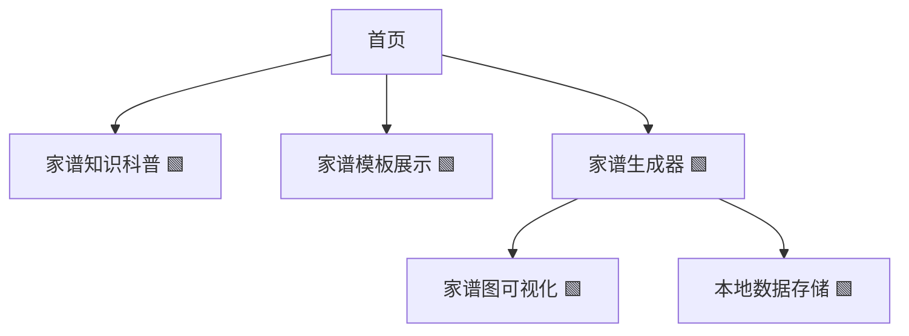
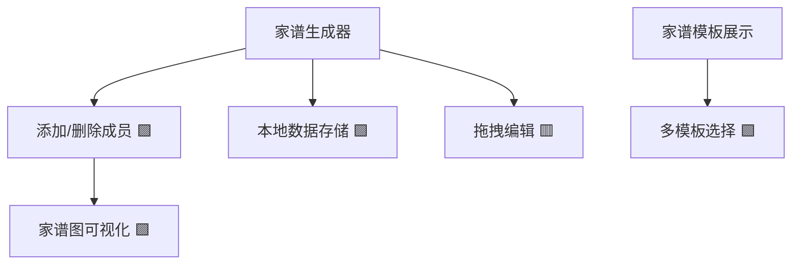
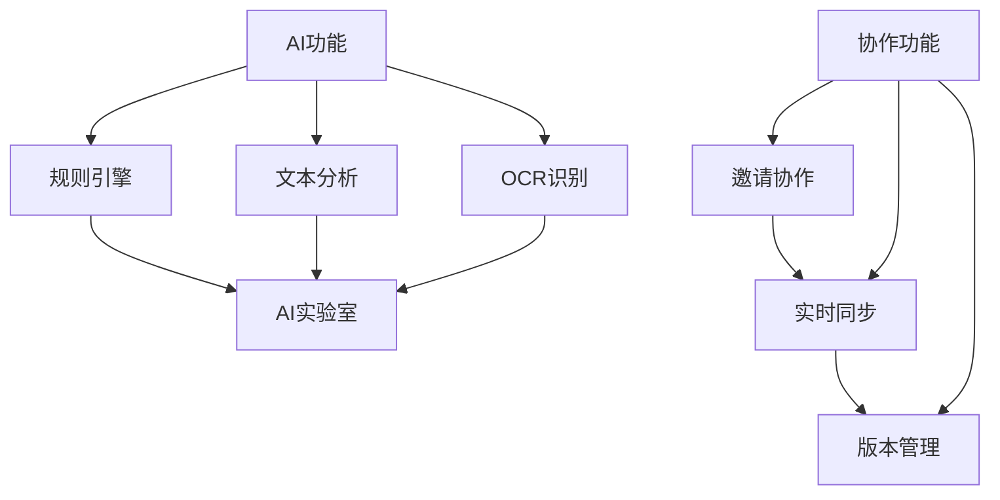

# Family Tree Website Development Plan (Based on Next.js 14, Individual Developer Iteration Plan)

> Note: This is the Chinese version of the development plan. The website interface has been converted to English.

## 一、项目定位与目标

- **定位**：为有家谱创建需求的用户提供简单易用、可视化、可导出的家谱制作工具，兼顾内容科普与实用模板，突出 SEO 优化。
- **目标用户**：家谱初学者、家族历史爱好者、基因研究兴趣者。
- **核心价值**：免费、易用、可视化、内容丰富、移动端友好。

---

## 二、技术选型

- **包管理工具**：pnpm（快速、节省磁盘空间的包管理器） 🟩【已完成】
- **前端框架**：Next.js 14（支持 SSR/SSG，利于 SEO） 🟩【已完成】
- **UI 框架**：Shadcn UI（基于Tailwind的组件库，高度可定制） 🟩【已完成】
- **状态管理**：React Context/Redux Toolkit（后期可选） 🟩【已完成】
- **数据存储**：本地存储（LocalStorage）为主，使用 Neon 作为云数据库进行数据持久化 🟩【已完成】
- **可选工具**：Mermaid.js（家谱图可视化）🟩【已完成】、html2canvas（导出图片）🟩【已完成】、jsPDF（导出 PDF）🟩【已完成】
- **内容管理**：MDX/Markdown 支持，便于内容型页面维护 🟥【待开发】
- **部署**：主要使用 Vercel 部署，优化自动化构建及发布流程 🟥【待开发】

---

## 三、功能迭代路线（从易到难）

### 1. MVP 阶段（基础功能）

- 首页：项目介绍、SEO 关键词布局 🟩【已完成】
- 家谱知识科普页：静态内容，分步指南、常见问题（FAQ） 🟩【已完成】
- 家谱模板展示页：静态模板图片/表格，支持下载 🟩【已完成】
- 简单家谱生成器（表单式）：用户输入成员信息，生成树状结构（静态渲染） 🟩【已完成】
- 移动端适配 🟩【已完成】

#### Mermaid 结构图

---

### 2. 进阶阶段（增强交互）

- 家谱生成器升级：可视化拖拽添加成员、编辑关系 🟥【待开发】
- 家谱图可视化：集成 Mermaid.js 渲染 🟩【已完成】
- 家谱数据本地保存/导入导出（JSON） 🟩【已完成】
- 模板多样化：支持多种家谱结构（祖先图、后代图） 🟩【已完成】
- SEO 优化：结构化数据、meta 标签、长尾关键词覆盖 🟧【进行中】

#### Mermaid 结构图

---

### 3. 高级阶段（可选扩展）

#### 3.1 AI 辅助家谱分析与自动补全

- 自动识别用户输入的家谱成员信息，智能补全缺失关系（如推断父母、兄弟姐妹等）。 🟥【待开发】
- 提供家谱结构优化建议（如检测重复、异常关系）。 🟥【待开发】
- 支持自然语言输入，自动生成家谱结构（如"张三的父亲是张二，母亲是李四"自动转为节点关系）。 🟥【待开发】
- 可选：OCR 识别手写/图片家谱，自动转为结构化数据。 🟥【待开发】

#### 3.2 家谱协作编辑功能

- 支持多用户共同编辑同一个家谱（如家庭成员协作完善家谱）。 🟥【待开发】
- 实时同步（多人同时在线编辑）或异步协作（邀请他人补充、审核）。 🟥【待开发】
- 变更历史与版本回溯，防止误操作。 🟥【待开发】

#### 3.3 高级功能演进路线 Mermaid 图

---

## 四、SEO 与内容优化建议

- 关键词布局：在首页、科普页、模板页、生成器页自然融入"如何制作家谱"、"家谱示例"、"家谱模板"等关键词 🟩【已完成】
- 内容结构：分步指南、FAQ、小标题清晰 🟩【已完成】
- 视觉辅助：家谱图示例、模板下载 🟩【已完成】
- 移动端友好：响应式设计 🟩【已完成】
- 结构化数据：JSON-LD 标注家谱相关内容 🟧【进行中】

---

## 五、数据安全与隐私注意事项

- 使用 Neon 数据库作为主要存储，本地存储仅作为备份 🟩【已完成】
- 完全屏蔽数据库连接信息，增强数据安全性 🟩【已完成】
- 提示用户数据隐私风险，并在数据库不可用时自动使用本地存储备份 🟩【已完成】
- 用户认证与数据权限控制 🟩【已完成】
- 后期如涉及协作/注册，需考虑基础权限与数据加密 🟥【待开发】

---

## 六、可扩展性与后续方向

- 支持多语言（i18n） 🟥【待开发】
- 家谱图导出为图片/PDF 🟩【已完成】
- 内容型页面支持 Markdown/MDX 🟥【待开发】
- 后台内容管理（可选） 🟥【待开发】

---

## 七、单元测试与质量保证

- **测试框架**：Jest（JavaScript 测试框架）和 React Testing Library（组件测试）🟥【待开发】
- **测试覆盖率**：目标覆盖率 75%+ 的核心功能 🟥【待开发】
- **测试类型**：
  - 单元测试：针对独立函数和工具方法 🟥【待开发】
  - 组件测试：验证 UI 组件渲染和交互 🟥【待开发】
  - 集成测试：测试多个组件之间的交互 🟥【待开发】
  - API 测试：验证后端接口功能 🟥【待开发】
- **测试自动化**：
  - CI/CD 集成：GitHub Actions 自动化测试流程 🟥【待开发】
  - 提交前测试：husky 钩子确保提交前测试通过 🟥【待开发】
- **代码质量工具**：
  - ESLint：代码风格和质量检查 🟩【已完成】
  - TypeScript：类型检查 🟩【已完成】
  - Prettier：代码格式化 🟥【待开发】
  - SonarQube：代码质量分析（可选） 🟥【待开发】

---

## 八、高优先级优化任务

以下是需要立即进行的高优先级优化任务：

### 1. 用户账户系统（最高优先级 ⭐️）
- 实现用户账户与家谱数据关联 🟩【已完成】
- 当用户点击"Save to Database"时提醒必须登录 🟩【已完成】
- 集成谷歌账号登录方式 🟩【已完成】
- 实现用户认证状态管理（Context API） 🟩【已完成】
- 添加用户个人资料页面 🟩【已完成】
- 实现用户家谱数据的权限控制 🟧【进行中】
- 添加登录/注册页面和组件 🟩【已完成】

### 2. 模板资源完善
- 添加模板图片文件（template1.jpg, template2.jpg, template3.jpg）到 public 目录 🟩【已完成】
- 添加模板下载文件（template1.html, template2.html, template3.html）到 public 目录 🟩【已完成】

### 3. 错误处理优化
- 替换家谱生成器页面中的 alert 为更友好的错误提示 UI 🟩【已完成】
- 实现更详细的错误日志和用户反馈机制 🟩【已完成】
- 添加错误边界组件捕获渲染错误 🟥【待开发】

### 4. 代码结构优化
- 将家谱生成器页面拆分为更小的组件 🟩【已完成】
- 将数据处理逻辑抽离到自定义 hooks 🟩【已完成】
- 使用 Context API 管理状态 🟩【已完成】

### 5. 安全性增强
- 完全屏蔽数据库 URL，不在日志中显示任何部分 🟩【已完成】
- 使用环境变量管理所有敏感信息 🟩【已完成】
- 添加数据验证和清理 🟥【待开发】

### 6. 可访问性改进
- 添加适当的 ARIA 属性 🟥【待开发】
- 确保颜色对比度符合 WCAG 标准 🟥【待开发】
- 添加键盘导航支持 🟥【待开发】

---

## 九、项目当前进度总结（2025年4月23日更新）

### 已完成功能
- 项目基础架构搭建完成，使用 Next.js 14 和 pnpm
- UI 框架采用 Shadcn UI（基于 Tailwind CSS）
- 完成 README 文档，明确项目定位、功能、技术栈和开发流程
- 目录结构标准化，便于后续开发与协作
- 首页、知识科普页、模板展示页、家谱生成器基础页面已完成
- 网站基础组件（导航栏、页脚）已完成并优化
- 移动端响应式适配已完成
- 对基础页面和组件进行了代码优化（使用 Shadcn UI 组件、优化布局、添加交互等）
- 实现家谱生成器的核心功能（添加、删除成员）
- 集成 Mermaid.js 实现家谱图可视化渲染
- 实现家谱数据的本地存储和加载功能
- 实现 Neon 数据库集成，支持家谱数据的云端存储与同步
- 优化数据存储逻辑，优先使用数据库，本地存储仅作备份
- 完全屏蔽数据库连接信息，增强数据安全性
- 将网站界面从中文转换为英文，并设置英语为主要语言
- 更新 Image 组件使用 Next.js 最新的图片 API
- 优化 MermaidChart 组件性能，改进 useEffect 的依赖关系
- 优化 Next.js 配置，添加图片优化和安全相关设置
- 将数据库连接日志信息和注释更新为英文
- 实现用户认证系统，支持 Google 账号登录
- 实现用户账户与家谱数据关联
- 添加登录/注册功能和相关组件
- 实现"Save to Database"时的登录提醒功能

### 进行中功能
- SEO 优化和结构化数据标注
- 用户家谱数据的权限控制

### 最近完成功能
- 添加用户个人资料页面，显示用户信息和家谱列表
- 更新导航栏，添加个人资料页面入口
- 创建useFamilyTree、useFamilyTreeMembers、useFamilyTreeStorage等自定义hooks，抽离数据处理逻辑
- 重构家谱生成器页面，拆分为MemberForm、MemberList和FamilyTreeChart组件
- 创建ErrorDialog组件，替换alert提示为更友好的错误提示UI
- 改进错误处理机制，添加详细错误提示和自定义操作
- 优化代码结构，增强可维护性
- 完善模板资源，添加三种不同风格的家谱模板（经典、现代简约、插图版本）
- 创建模板图片文件和HTML格式的下载模板
- 更新所有模板内容为英文，适合英语用户使用
- 实现家谱图导出功能，支持导出为PNG图片和PDF文档
- 集成html2canvas和jsPDF库实现高质量图表导出

### 下一阶段计划
- 添加用户个人资料页面
- 实现家谱生成器的可视化拖拽功能 🟥【待开发】
- 实现家谱图导出为图片/PDF功能 🟩【已完成】
- 完善家谱生成器的复杂关系设置功能（如配偶、兄弟姐妹等） 🟥【待开发】
- 添加更多成员属性（如照片、详细介绍等） 🟥【待开发】
- 进一步优化 UI/UX 和移动端体验 🟥【待开发】

---

> 注：本计划将根据 README.md 及实际开发进度持续同步和完善。

## 总结

本开发计划适合个人开发者按需推进，先实现内容与基础工具，逐步增强交互与可视化，最后探索协作、AI 等高级功能。每一阶段都可独立上线，便于持续优化和 SEO 积累。

---

**状态说明：**
- 🟥 待开发
- 🟧 进行中
- 🟩 已完成
