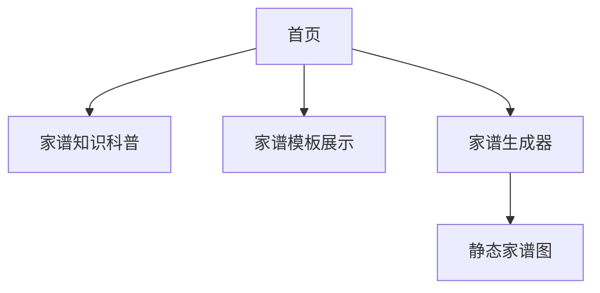
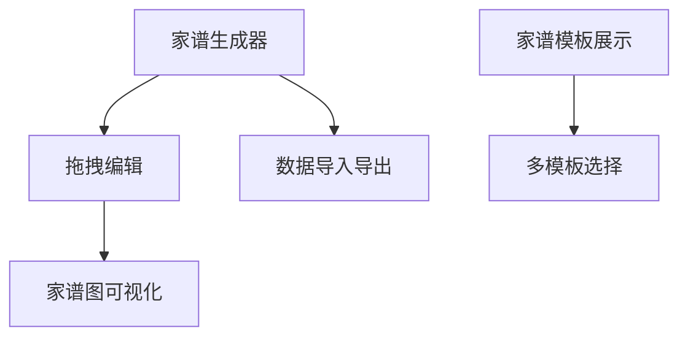
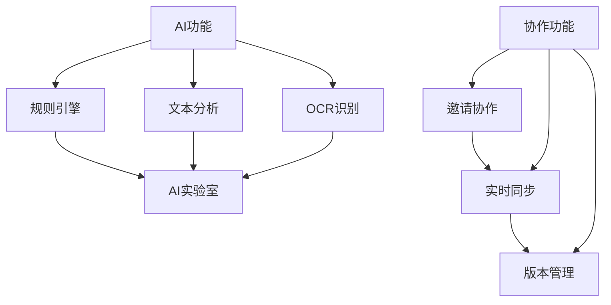

# 家谱网站开发计划（基于 Next.js 14，个人开发者迭代方案）

## 一、项目定位与目标

- **定位**：为有家谱创建需求的用户提供简单易用、可视化、可导出的家谱制作工具，兼顾内容科普与实用模板，突出 SEO 优化。
- **目标用户**：家谱初学者、家族历史爱好者、基因研究兴趣者。
- **核心价值**：免费、易用、可视化、内容丰富、移动端友好。

---

## 二、技术选型

- **包管理工具**：pnpm（快速、节省磁盘空间的包管理器） 🟩【已完成】
- **前端框架**：Next.js 14（支持 SSR/SSG，利于 SEO） 🟩【已完成】
- **UI 框架**：Shadcn UI（基于Tailwind的组件库，高度可定制） 🟩【已完成】
- **状态管理**：React Context/Redux Toolkit（后期可选） 🟥【待开发】
- **数据存储**：本地存储（LocalStorage）为主，后期扩展云端（例如使用 Neon 作为云数据库） 🟥【待开发】
- **可选工具**：Mermaid.js（家谱图可视化）、html2canvas（导出图片）、jsPDF（导出 PDF） 🟥【待开发】
- **内容管理**：MDX/Markdown 支持，便于内容型页面维护 🟥【待开发】
- **部署**：主要使用 Vercel 部署，优化自动化构建及发布流程 🟥【待开发】

---

## 三、功能迭代路线（从易到难）

### 1. MVP 阶段（基础功能）

- 首页：项目介绍、SEO 关键词布局 🟩【已完成】
- 家谱知识科普页：静态内容，分步指南、常见问题（FAQ） 🟩【已完成】
- 家谱模板展示页：静态模板图片/表格，支持下载 🟩【已完成】
- 简单家谱生成器（表单式）：用户输入成员信息，生成树状结构（静态渲染） 🟩【已完成】
- 移动端适配 🟩【已完成】

#### Mermaid 结构图

---

### 2. 进阶阶段（增强交互）

- 家谱生成器升级：可视化拖拽添加成员、编辑关系 🟧【进行中】
- 家谱图可视化：集成 Mermaid.js 或自定义 SVG 渲染 🟥【待开发】
- 家谱数据本地保存/导入导出（JSON） 🟥【待开发】
- 模板多样化：支持多种家谱结构（祖先图、后代图） 🟩【已完成】
- SEO 优化：结构化数据、meta 标签、长尾关键词覆盖 🟧【进行中】

#### Mermaid 结构图

---

### 3. 高级阶段（可选扩展）

#### 3.1 AI 辅助家谱分析与自动补全

- 自动识别用户输入的家谱成员信息，智能补全缺失关系（如推断父母、兄弟姐妹等）。 🟥【待开发】
- 提供家谱结构优化建议（如检测重复、异常关系）。 🟥【待开发】
- 支持自然语言输入，自动生成家谱结构（如“张三的父亲是张二，母亲是李四”自动转为节点关系）。 🟥【待开发】
- 可选：OCR 识别手写/图片家谱，自动转为结构化数据。 🟥【待开发】

#### 3.2 家谱协作编辑功能

- 支持多用户共同编辑同一个家谱（如家庭成员协作完善家谱）。 🟥【待开发】
- 实时同步（多人同时在线编辑）或异步协作（邀请他人补充、审核）。 🟥【待开发】
- 变更历史与版本回溯，防止误操作。 🟥【待开发】

#### 3.3 高级功能演进路线 Mermaid 图

---

## 四、SEO 与内容优化建议

- 关键词布局：在首页、科普页、模板页、生成器页自然融入“如何制作家谱”、“家谱示例”、“家谱模板”等关键词 🟩【已完成】
- 内容结构：分步指南、FAQ、小标题清晰 🟩【已完成】
- 视觉辅助：家谱图示例、模板下载 🟩【已完成】
- 移动端友好：响应式设计 🟩【已完成】
- 结构化数据：JSON-LD 标注家谱相关内容 🟧【进行中】

---

## 五、数据安全与隐私注意事项

- 本地存储为主，避免敏感数据上传 🟩【已完成】
- 若扩展云端存储，需提示用户数据隐私风险 🟥【待开发】
- 后期如涉及协作/注册，需考虑基础权限与数据加密 🟥【待开发】

---

## 六、可扩展性与后续方向

- 支持多语言（i18n） 🟥【待开发】
- 家谱图导出为图片/PDF 🟧【进行中】
- 内容型页面支持 Markdown/MDX 🟥【待开发】
- 后台内容管理（可选） 🟥【待开发】

---

## 七、项目当前进度总结（2025年4月15日更新）

### 已完成功能
- 项目基础架构搭建完成，使用 Next.js 14 和 pnpm
- UI 框架采用 Shadcn UI（基于 Tailwind CSS）
- 完成中英文 README 文档，明确项目定位、功能、技术栈和开发流程
- 目录结构标准化，便于后续开发与协作
- 首页已完成英文化与美观优化，按钮导航自适应英文内容，UI 升级
- 首页、知识科普页、模板展示页、家谱生成器等基础页面准备就绪
- 网站基础组件（导航栏、页脚等）
- 移动端响应式适配

### 进行中功能
- 可视化拖拽式家谱编辑器（英文化与交互升级中）
- 家谱导出功能（PNG、PDF 和 JSON 格式）
- SEO 优化和结构化数据标注

### 下一阶段计划
- 家谱生成器英文化与核心交互升级（拖拽、节点关系编辑）
- 设计与完善家谱数据结构，支持本地存储与导入导出
- 集成 Mermaid.js 实现家谱图可视化
- 优化用户体验和界面交互

---

> 注：本计划将根据 README.md 及实际开发进度持续同步和完善。

## 总结

本开发计划适合个人开发者按需推进，先实现内容与基础工具，逐步增强交互与可视化，最后探索协作、AI 等高级功能。每一阶段都可独立上线，便于持续优化和 SEO 积累。

---

**状态说明：**  
- 🟥 待开发  
- 🟧 进行中  
- 🟩 已完成